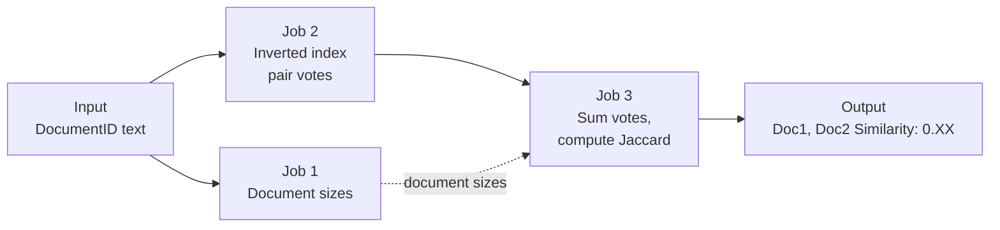

## Three-stage Hadoop MapReduce pairwise Jaccard similarity via inverted index, benchmarked on 1 vs 3 DataNodes

A Java implementation of pairwise document similarity on Hadoop MapReduce. Each document is reduced to its set of unique normalized terms, and the pipeline computes the Jaccard similarity of every document pair that shares at least one term. Rather than comparing every document with every other document directly, it builds an inverted index, so work scales with actual term overlap. Document sizes are computed once, and set unions are derived by inclusion-exclusion. The pipeline runs on Dockerized Hadoop 3.2.1 clusters and is benchmarked on 1-DataNode and 3-DataNode configurations across three synthetic datasets.

---

## Algorithm

For two documents with term sets *A* and *B*:

$$J(A,B) = \frac{|A \cap B|}{|A \cup B|} = \frac{|A \cap B|}{|A| + |B| - |A \cap B|}$$

The second form is the key to a scalable implementation. Set sizes |A| and |B| are computed once per document, so the pipeline only has to count the **intersection** for each pair. The union then follows from inclusion-exclusion without comparing full term sets.

Intersections are counted with an **inverted index**. Each term's posting list (the documents containing it) generates one vote per document pair in the list. Summing the votes for a pair gives |A ∩ B|. Pairs that share no terms are never generated.

### Preprocessing

Each input line has the form `DocumentID <text...>`. The text is lowercased, stripped of non-alphanumeric characters, split on whitespace, and deduplicated into a set, so every term counts once per document.

---

## Pipeline



| Job | Mapper | Reducer | Output |
|---|---|---|---|
| 1. Document sizes | `DocSizeMapper`: emits `(docId, 1)` per unique term | `DocSizeReducer`: sums to `(docId, \|D\|)` | `/output_doc_sizes` |
| 2. Pair intersections | `WordToDocMapper`: emits `(term, docId)` per unique term | `PairIntersectionReducer`: for each term's posting list, emits `(pair, 1)` for every document pair in it | `/output_pair_counts` |
| 3. Jaccard | `PairCountPassThroughMapper`: forwards `(pair, 1)` | `JaccardReducer`: sums votes into \|A ∩ B\|, loads the Job 1 sizes, computes J and rounds to two decimals | `/output_jaccard` |

The driver, `com.example.controller.DocumentSimilarityDriver`, runs the three jobs in sequence.

### Design highlights

- **Inverted-index pair generation.** Work is proportional to term co-occurrence rather than to the number of document pairs, and pairs with no overlap cost nothing.
- **Inclusion-exclusion union.** Only intersections are aggregated. Unions are computed arithmetically from the precomputed document sizes.
- **Set semantics.** Terms are deduplicated per document before any records are emitted, which matches the set definition of Jaccard and reduces shuffle volume.
- **Side data in the final reducer.** Document sizes from Job 1 are loaded as cached side data in Job 3 instead of being joined through another shuffle.
- **Unordered pair keys.** Each document pair is emitted once in a consistent order (for example, `Document1, Document10`), so votes for the same pair always reach the same reducer group.

---

## Datasets

`datagen.py` generates three synthetic corpora with a fixed seed (`random.Random(6190)`), so the output is reproducible. The vocabulary is split into 8 topics. Each document takes 70% of its tokens from one randomly chosen topic and 30% from the full vocabulary, which gives the corpus real similarity structure to recover.

| Dataset | Documents | Tokens / doc | Vocabulary | Avg. unique terms / doc | Document pairs | Size |
|---|---:|---:|---:|---:|---:|---:|
| small | 50 | 200 | 500 | 105.8 | 1,225 | 50,541 bytes |
| medium | 100 | 400 | 1,500 | 250.2 | 4,950 | 241,092 bytes |
| large | 150 | 800 | 3,000 | 499.7 | 11,175 | 721,692 bytes |

```bash
python3 datagen.py
wc datasets/*.txt
#     50   10050   50541 datasets/small.txt
#    100   40100  241092 datasets/medium.txt
#    150  120150  721692 datasets/large.txt
```

### Shuffle volume

Job 2 emits one `(pair, 1)` record for every pair of documents that share a term, so its output grows much faster than the input:

| Dataset | Input tokens | Job 2 `(pair, 1)` records |
|---|---:|---:|
| small | 10,000 | 26,908 |
| medium | 40,000 | 209,057 |
| large | 120,000 | 924,587 |

From small to large, the input grows 12x while the intermediate pair records grow about 34x. Pair generation is quadratic in posting-list length, and this is the dominant cost of the pipeline.

---

## Build

```bash
mvn -DskipTests clean package
# Artifact:   target/DocumentSimilarity-0.0.1-SNAPSHOT.jar
# Main class: com.example.controller.DocumentSimilarityDriver
```

---

## Running on a Dockerized Hadoop Cluster

### 1. Start a cluster

**3 DataNodes** (default):

```bash
docker compose up -d
```

**1 DataNode:**

```bash
docker compose down --remove-orphans
docker compose -f docker-compose-single-datanode.yml up -d

# Confirm the DataNode count
docker exec resourcemanager bash -lc \
  '/opt/hadoop-3.2.1/bin/hdfs dfsadmin -report | grep -E "Live datanodes" -A2'
# Expected: Live datanodes (1)
```

`--remove-orphans` matters here. Without it, DataNodes from the 3-node configuration keep running and skew the single-node benchmark.

### 2. Stage the JAR and datasets

```bash
docker cp target/DocumentSimilarity-0.0.1-SNAPSHOT.jar \
  resourcemanager:/opt/hadoop-3.2.1/share/hadoop/mapreduce/app.jar
docker exec resourcemanager bash -lc 'mkdir -p /opt/hadoop-3.2.1/share/hadoop/mapreduce/datasets'
docker cp datasets/. resourcemanager:/opt/hadoop-3.2.1/share/hadoop/mapreduce/datasets/
```

### 3. Run and time a dataset

Set `NAME` to the dataset and `TAG` to the cluster configuration, then run:

```bash
NAME=medium   # small | medium | large
TAG=3dn       # 3dn | 1dn

docker exec -e NAME=$NAME -e TAG=$TAG resourcemanager bash -lc '
  H=/opt/hadoop-3.2.1/bin
  JAR=/opt/hadoop-3.2.1/share/hadoop/mapreduce/app.jar
  DS=/opt/hadoop-3.2.1/share/hadoop/mapreduce/datasets/$NAME.txt

  $H/hdfs dfs -rm -r -f /input/$NAME /output_doc_sizes /output_pair_counts /output_jaccard
  $H/hdfs dfs -mkdir -p /input/$NAME
  $H/hdfs dfs -put -f $DS /input/$NAME/

  set -o pipefail
  { time -p $H/hadoop jar $JAR com.example.controller.DocumentSimilarityDriver \
      /input/$NAME/$NAME.txt /output_doc_sizes /output_pair_counts /output_jaccard ; } \
      2>&1 | tee /tmp/run_${NAME}_${TAG}.log

  $H/hdfs dfs -cat /output_jaccard/part-* > /tmp/jaccard_${NAME}_${TAG}.txt
'

mkdir -p results-$TAG/$NAME/output_jaccard
docker cp resourcemanager:/tmp/run_${NAME}_${TAG}.log      results-$TAG/$NAME/timing.txt
docker cp resourcemanager:/tmp/jaccard_${NAME}_${TAG}.txt  results-$TAG/$NAME/output_jaccard/part-r-00000
```

Hadoop binaries are called by absolute path because they aren't on the container's default `PATH`.

---

## Results

### Output format

```
Document1, Document10	Similarity: 0.09
Document1, Document11	Similarity: 0.10
Document1, Document12	Similarity: 0.07
Document1, Document13	Similarity: 0.10
Document1, Document14	Similarity: 0.11
```

Hadoop's `TextOutputFormat` separates key and value with a tab by default. To get a single space instead, set `mapreduce.output.textoutputformat.separator` to `" "`.

### Correctness

The MapReduce output was checked against an independent single-machine Python implementation that uses the same preprocessing. The sample rows above match the reference values exactly.

In every dataset, all document pairs share at least one term (because 30% of each document is drawn from the shared vocabulary), so the output covers every pair: 1,225, 4,950, and 11,175 rows.

The similarity scores recover the topic structure that the generator planted:

| Dataset | Mean J, same-topic pairs | Mean J, cross-topic pairs | Max J |
|---|---:|---:|---:|
| small | 0.367 | 0.089 | 0.426 |
| medium | 0.338 | 0.063 | 0.394 |
| large | 0.336 | 0.063 | 0.377 |

Documents on the same topic are about 4 to 5 times more similar than documents on different topics.

The 1-DataNode and 3-DataNode outputs are identical, which you can check with:

```bash
for d in small medium large; do
  diff -q results-1dn/$d/output_jaccard/part-r-00000 results-3dn/$d/output_jaccard/part-r-00000
done
```

### Benchmark: 1 vs 3 DataNodes

Wall-clock times (`real`, from `time -p`) for the complete three-job pipeline:

| Dataset | 3 DataNodes (s) | 1 DataNode (s) | Runtime ratio (3DN / 1DN) |
|---|---:|---:|---:|
| small | 56.68 | 5.97 | 9.49x |
| medium | 53.67 | 8.00 | 6.71x |
| large | 57.90 | 10.09 | 5.74x |

**Interpretation**

- **The 1-DataNode configuration is faster in this environment.** Every container runs on a single Codespaces VM, so extra DataNodes add no hardware. They compete for the same CPU, memory, and disk while adding RPC, scheduling, and replication overhead.
- **The 3-DataNode runtime is dominated by fixed overhead.** Its times stay nearly flat (54–58 s) while the pair records grow 34x. Job startup and coordination, not data volume, determine its runtime at this scale.
- **The gap narrows as data grows.** The ratio falls from 9.5x to 5.7x as the amount of real work rises relative to fixed overhead.
- **On physically separate hosts, the result would be expected to reverse.** With independent machines, additional DataNodes add I/O bandwidth and data locality, which benefits larger inputs.

---

## Limitations and Scaling Considerations

- **Quadratic posting lists.** A term that appears in *k* documents generates *k(k−1)/2* pair records. At web scale, very common terms dominate the shuffle. Standard mitigations are stop-word removal, a document-frequency cap, or approximate methods such as MinHash with locality-sensitive hashing.
- **No combiner.** Job 3 shuffles every individual `(pair, 1)` record. A combiner that pre-sums votes on the map side, or summing them in Job 2's reducer, would cut shuffle volume substantially.
- **Side data must fit in memory.** The Job 3 reducer holds every document size in memory. That's fine for thousands of documents, but a very large corpus would need a reduce-side join instead.
- **Zero-overlap pairs are omitted.** Pairs that share no terms produce no output rather than an explicit 0.00. That doesn't affect these datasets, where every pair overlaps.
- **Two-decimal rounding.** Scores are rounded for display, so pairs with close similarities can tie in the output.

---

## Troubleshooting

| Symptom | Resolution |
|---|---|
| `hadoop: command not found` inside a container | Use the absolute paths `/opt/hadoop-3.2.1/bin/hadoop` and `/opt/hadoop-3.2.1/bin/hdfs` |
| Extra DataNodes still running after switching configurations | Run `docker compose down --remove-orphans` before starting the single-DataNode file |
| `Output directory ... already exists` | Delete the outputs first; the run script does this with `hdfs dfs -rm -r -f` |
| `UnsupportedClassVersionError` | Compile for the cluster's Java version by setting `maven.compiler.release` in `pom.xml` to match the containers' JDK |
| Datasets differ in size but not in unique-term counts | Scale the vocabulary along with document length, as `datagen.py` does |

---

## Repository Layout

```
hadoop-jaccard-similarity/
├── docker-compose.yml                    # 3-DataNode cluster
├── docker-compose-single-datanode.yml    # 1-DataNode cluster
├── pom.xml
├── datagen.py                            # Seeded synthetic corpus generator
├── compare_timings.py                    # Timing comparison helper
├── src/main/java/com/example/
│   ├── ...                               # Mappers and reducers
│   └── controller/DocumentSimilarityDriver.java
├── datasets/
│   ├── small.txt
│   ├── medium.txt
│   └── large.txt
├── results-3dn/{small,medium,large}/
│   ├── timing.txt
│   └── output_jaccard/part-r-00000
└── results-1dn/{small,medium,large}/
    ├── timing.txt
    └── output_jaccard/part-r-00000
```
